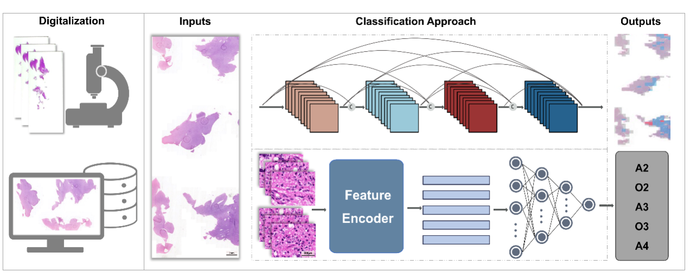

# HAS-Bt

**HAS-Bt** stands for Histopathology Auxilliary System for Brain Tumour classification 
---
The is the code repository for the paper: 

*A Multi-center performance assessment for automated histopathological classification and grading of glioma using whole slide image*
Lei Jin*, Tianyang Sun, Xi Liu, Zehong Cao, Yan Liu, Hong Chen, Yixin Ma, Jun Zhang, Yaping Zou, Yingchao Liu*, Feng Shi*, Dinggang Shen*, Jinsong Wu

---

## Link to paper and Authors

// to be specified

## Abstract

Feature-to-label MIL model is demonstrated in 

- .HAS_slide/network/MultiAttentionNoFe.py
  
Image-to-label MIL model is demonstrated in 

- .HAS_slide/network/ImageMIL.py

**Data related to this study including WSIs, and patch images are available from the lead contact upon reasonable request. For any request please contact the corresponding author**
